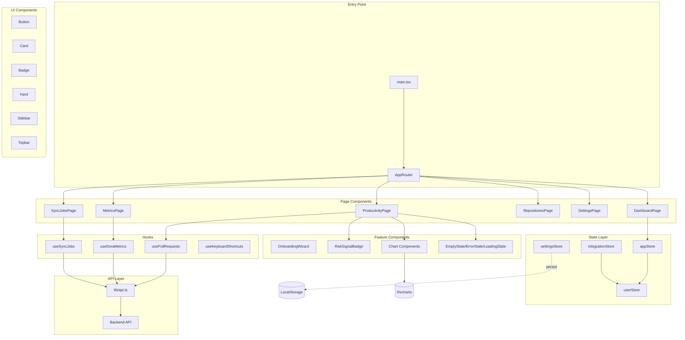
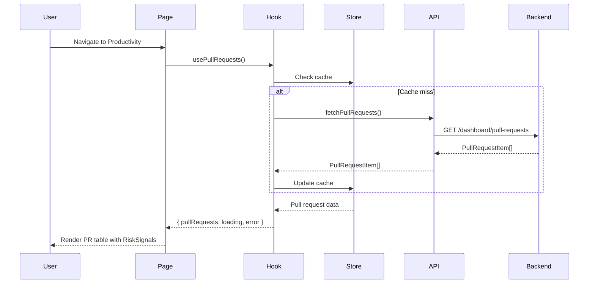
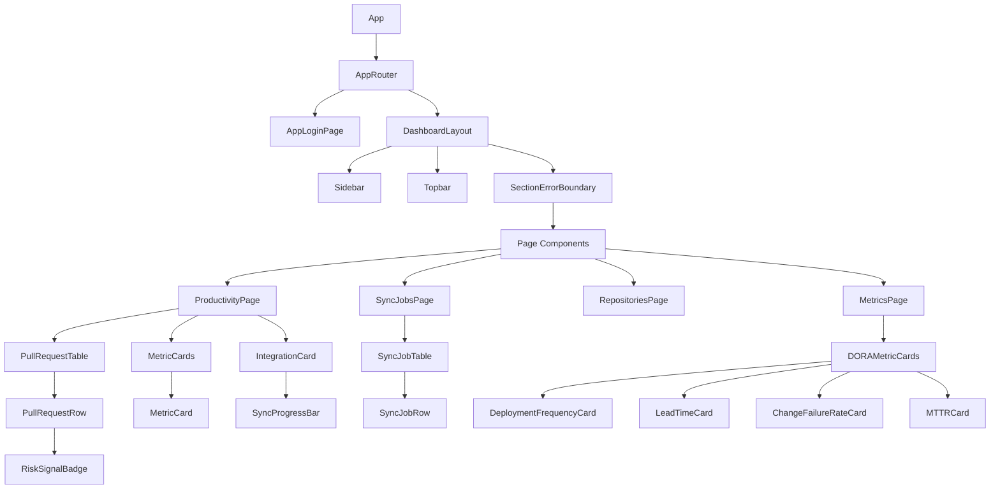
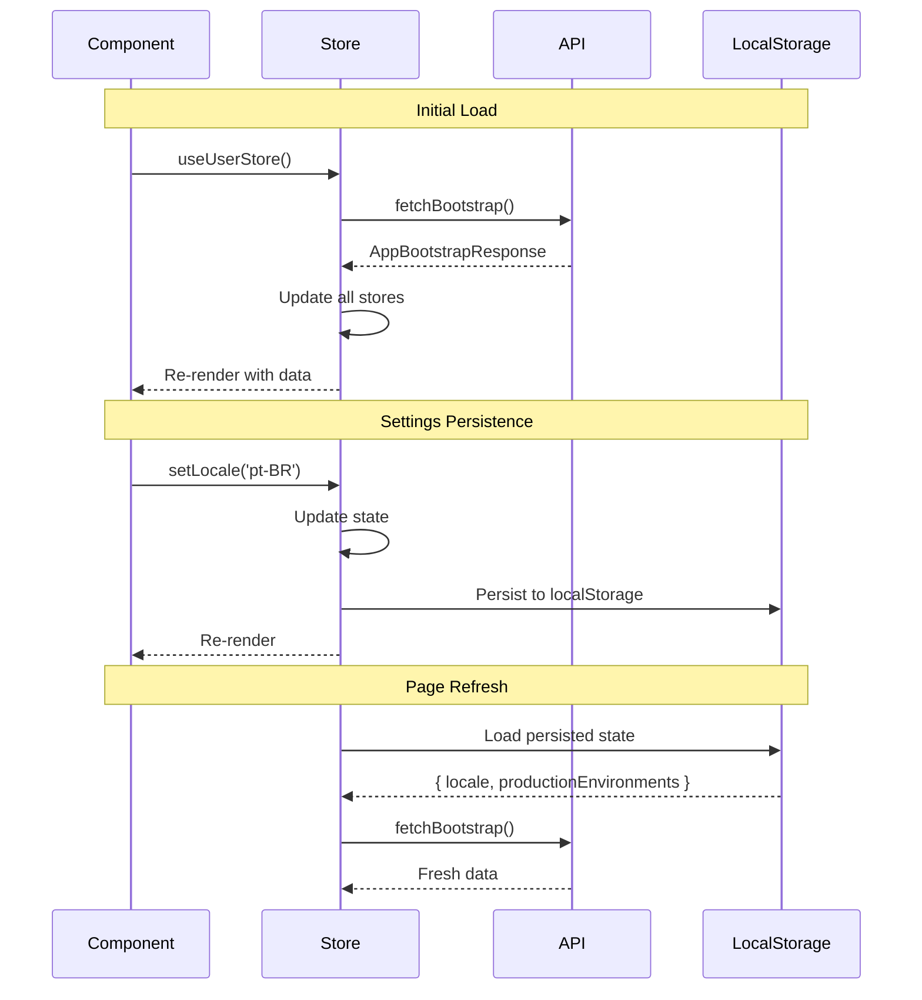

# Design Document: Frontend Evolution

## Overview

DevInsights frontend evolution transforms the current 1200+ line monolithic React application into a modern, scalable architecture. The redesign introduces modular component organization, centralized state management with Zustand, code splitting for performance, and comprehensive developer tooling.

### Current State

- Single file: `apps/web/src/main.tsx` (1274 lines)
- All components inline
- Scattered useState hooks (30+ local state variables)
- No code splitting
- No state management library
- Basic TypeScript usage

### Target State

- Modular directory structure with clear separation of concerns
- Zustand for global state management
- React.lazy + Suspense for code splitting
- Recharts for data visualization
- Full TypeScript strict mode
- Storybook for component development
- Comprehensive accessibility support

### Key Technical Decisions

| Decision | Choice | Rationale |
|----------|--------|-----------|
| State Management | Zustand | Lightweight, TypeScript-friendly, no Provider boilerplate, built-in DevTools |
| Charts | Recharts | React-native, composable, good TypeScript support, active maintenance |
| Code Splitting | React.lazy + Suspense | Native React solution, sufficient for route-level splitting |
| i18n | Custom lightweight | Avoid heavy libraries; simple key-value with Intl formatters |
| Virtualization | @tanstack/react-virtual | Industry standard, headless (works with our styling) |
| Animations | Tailwind + CSS transitions | Simplicity, respects prefers-reduced-motion automatically |

---

## Architecture

### Directory Structure

```
apps/web/src/
├── components/              # Reusable UI components
│   ├── ui/                 # Base primitives (Button, Badge, Card, Input, etc.)
│   ├── state/              # EmptyState, ErrorState, LoadingState
│   ├── charts/             # Chart wrappers (ThroughputChart, PRVolumeChart, etc.)
│   ├── layout/             # Sidebar, Topbar, Navigation, MobileDrawer
│   ├── onboarding/         # OnboardingWizard, OnboardingStep
│   └── risk-signals/       # RiskSignalBadge, RiskSignalLegend
├── pages/                  # Route-level page components
│   ├── DashboardPage.tsx
│   ├── ProductivityPage.tsx
│   ├── MetricsPage.tsx
│   ├── RepositoriesPage.tsx
│   ├── TeamsPage.tsx
│   ├── IntegrationsPage.tsx
│   ├── SettingsPage.tsx
│   └── SyncJobsPage.tsx
├── hooks/                  # Custom React hooks
│   ├── useKeyboardShortcuts.ts
│   ├── useLocale.ts
│   ├── usePullRequests.ts
│   ├── useSyncJobs.ts
│   └── useDoraMetrics.ts
├── stores/                 # Zustand stores
│   ├── appStore.ts         # Global app state (section, demo mode, etc.)
│   ├── userStore.ts        # User data, organizations, preferences
│   ├── integrationStore.ts # GitHub integration state
│   └── settingsStore.ts    # User preferences with persistence
├── lib/                    # Utilities and API client
│   ├── api.ts              # Fetch wrapper with error handling
│   ├── formatters.ts       # Date, number formatting with locale
│   ├── risk-signals.ts     # Risk signal calculation functions
│   └── export.ts           # CSV export utilities
├── types/                  # TypeScript interfaces
│   ├── api.ts              # API response types
│   ├── components.ts       # Component prop types
│   └── store.ts            # Store state types
├── i18n/                   # Internationalization
│   ├── index.ts            # i18n setup and useTranslation hook
│   ├── locales/
│   │   ├── en.json
│   │   └── pt-BR.json
├── styles/
│   └── globals.css         # Tailwind imports, custom utilities
├── main.tsx                # App entry point (minimal routing)
└── vite-env.d.ts
```

### Architecture Diagram



### Data Flow Diagram



---

## Components and Interfaces

### Component Hierarchy



### Key Component Signatures

#### UI Components

```typescript
// components/ui/Button.tsx
interface ButtonProps {
  variant: 'primary' | 'secondary' | 'ghost' | 'danger';
  size: 'sm' | 'md' | 'lg';
  disabled?: boolean;
  loading?: boolean;
  children: React.ReactNode;
  onClick?: () => void;
  type?: 'button' | 'submit';
  className?: string;
}

export function Button(props: ButtonProps): JSX.Element;

// components/ui/Card.tsx
interface CardProps {
  title?: string;
  subtitle?: string;
  action?: React.ReactNode;
  children: React.ReactNode;
  className?: string;
}

export function Card(props: CardProps): JSX.Element;

// components/ui/Badge.tsx
interface BadgeProps {
  variant: 'default' | 'success' | 'warning' | 'error' | 'info';
  size: 'sm' | 'md';
  children: React.ReactNode;
}

export function Badge(props: BadgeProps): JSX.Element;
```

#### State Components

```typescript
// components/state/EmptyState.tsx
interface EmptyStateProps {
  icon?: React.ReactNode;
  title: string;
  description?: string;
  action?: {
    label: string;
    onClick: () => void;
  };
}

export function EmptyState(props: EmptyStateProps): JSX.Element;

// components/state/ErrorState.tsx
interface ErrorStateProps {
  message: string;
  onRetry?: () => void;
}

export function ErrorState(props: ErrorStateProps): JSX.Element;

// components/state/LoadingState.tsx
interface LoadingStateProps {
  message?: string;
  progress?: number; // 0-100 for determinate progress
}

export function LoadingState(props: LoadingStateProps): JSX.Element;
```

#### Risk Signal Components

```typescript
// components/risk-signals/RiskSignalBadge.tsx
type RiskSignalType = 'stale' | 'large' | 'long-lived' | 'security' | 'bug' | 'maintainability';

interface RiskSignalBadgeProps {
  type: RiskSignalType;
  size?: 'sm' | 'md';
}

export function RiskSignalBadge(props: RiskSignalBadgeProps): JSX.Element;

// components/risk-signals/RiskSignalLegend.tsx
interface RiskSignalLegendProps {
  compact?: boolean;
}

export function RiskSignalLegend(props: RiskSignalLegendProps): JSX.Element;
```

#### Chart Components

```typescript
// components/charts/ThroughputChart.tsx
interface ThroughputChartProps {
  data: Array<{
    date: string;
    opened: number;
    merged: number;
  }>;
  period: '7d' | '30d' | '90d';
}

export function ThroughputChart(props: ThroughputChartProps): JSX.Element;

// components/charts/PRVolumeChart.tsx
interface PRVolumeChartProps {
  data: Array<{
    date: string;
    volume: number;
    mergeRate: number;
  }>;
}

export function PRVolumeChart(props: PRVolumeChartProps): JSX.Element;
```

#### Onboarding Components

```typescript
// components/onboarding/OnboardingWizard.tsx
interface OnboardingWizardProps {
  initialStep?: number;
  onComplete: () => void;
  onSkip?: () => void;
}

export function OnboardingWizard(props: OnboardingWizardProps): JSX.Element;

// components/onboarding/OnboardingStep.tsx
interface OnboardingStepProps {
  stepNumber: number;
  title: string;
  description: string;
  isComplete: boolean;
  isActive: boolean;
  children?: React.ReactNode;
}

export function OnboardingStep(props: OnboardingStepProps): JSX.Element;
```

#### Page Components

```typescript
// pages/ProductivityPage.tsx
export function ProductivityPage(): JSX.Element;

// pages/SyncJobsPage.tsx
export function SyncJobsPage(): JSX.Element;

// pages/MetricsPage.tsx
export function MetricsPage(): JSX.Element;

// pages/RepositoriesPage.tsx
export function RepositoriesPage(): JSX.Element;
```

---

## Data Models

### API Response Types

```typescript
// types/api.ts

export interface User {
  id: number;
  github_id: number;
  github_login: string;
  name: string | null;
  avatar_url: string | null;
}

export interface Organization {
  id: number;
  name: string;
  role: string;
}

export interface AppBootstrapResponse {
  user: User;
  organization: Organization | null;
  organizations: Organization[];
  activeOrganizationId: number | null;
  integration: IntegrationStatus;
  sync: SyncJob | null;
  repositoryInsights: RepositoryInsights;
}

export interface IntegrationStatus {
  connected: boolean;
  installationId?: number | null;
  selectedRepositories: number;
}

export interface SyncJob {
  id: number;
  status: 'pending' | 'running' | 'completed' | 'failed';
  processed_repositories: number;
  total_prs: number;
  error_message: string | null;
  started_at: string | null;
  finished_at: string | null;
}

export interface PullRequest {
  github_pr_id: number;
  number: number;
  title: string;
  repository_full_name: string;
  author_login: string | null;
  state: 'open' | 'closed';
  draft: boolean;
  additions: number;
  deletions: number;
  changed_files: number;
  opened_at: string | null;
  merged_at: string | null;
  updated_at: string | null;
  html_url: string | null;
}

export interface DashboardOverview {
  selectedRepositories: number;
  openPrs: number;
  throughput7d: number;
  throughput30d: number;
  avgPrSize: number;
  stalePrs: number;
  lastSync: {
    status: string;
    started_at: string | null;
    finished_at: string | null;
    total_prs: number;
  } | null;
}

export interface DoraOverview {
  status: 'setup_required' | 'partial' | 'available';
  period: '30d';
  deploymentFrequency30d: number;
  leadTimeForChangesHours: number | null;
  changeFailureRate: number | null;
  mttrHours: number | null;
  coverage: {
    productionEnvironmentsConfigured: boolean;
    deploymentsAvailable: boolean;
    workflowRunsAvailable: boolean;
    incidentsAvailable: boolean;
    leadTimeAvailable?: boolean;
  };
}

export interface Repository {
  id: number;
  full_name: string;
  private: boolean;
  selected: boolean;
}

export interface OnboardingStatus {
  organizationId: number | null;
  step: number;
  githubConnected: boolean;
  repositoriesSelected: boolean;
  syncStarted: boolean;
  syncCompleted: boolean;
  syncStatus?: string | null;
  productionConfigured?: boolean;
}
```

### Store State Types

```typescript
// types/store.ts

export interface AppState {
  section: Section;
  demoMode: boolean;
  avatarMenuOpen: boolean;
  error: string | null;
}

export interface UserState {
  user: User | null;
  organization: Organization | null;
  organizations: Organization[];
  activeOrganizationId: number | null;
}

export interface IntegrationState {
  connected: boolean;
  installationId: number | null;
  selectedRepositories: number;
  syncStatus: SyncJob | null;
  syncProgress: SyncProgress | null;
  repositories: Repository[];
}

export interface SettingsState {
  locale: Locale;
  productionEnvironments: string[];
  reducedMotion: boolean;
}

export type Section = 
  | 'dashboard' 
  | 'productivity' 
  | 'metrics' 
  | 'repositories' 
  | 'teams' 
  | 'integrations' 
  | 'settings';

export type Locale = 'en' | 'pt-BR';
```

---

## State Management

### Zustand Store Structure

```typescript
// stores/appStore.ts
import { create } from 'zustand';
import { devtools, persist } from 'zustand/middleware';
import type { AppState, Section } from '../types/store';

export const useAppStore = create<AppState>()(
  devtools(
    (set) => ({
      section: 'productivity',
      demoMode: false,
      avatarMenuOpen: false,
      error: null,
      
      setSection: (section: Section) => set({ section }),
      toggleDemoMode: () => set((state) => ({ demoMode: !state.demoMode })),
      setAvatarMenuOpen: (open: boolean) => set({ avatarMenuOpen: open }),
      setError: (error: string | null) => set({ error }),
    }),
    { name: 'app-store' }
  )
);

// stores/userStore.ts
import { create } from 'zustand';
import { devtools } from 'zustand/middleware';
import type { UserState, User, Organization } from '../types/store';

export const useUserStore = create<UserState>()(
  devtools(
    (set) => ({
      user: null,
      organization: null,
      organizations: [],
      activeOrganizationId: null,
      
      setUser: (user: User) => set({ user }),
      setOrganization: (organization: Organization | null) => set({ organization }),
      setOrganizations: (organizations: Organization[]) => set({ organizations }),
      setActiveOrganizationId: (id: number | null) => set({ activeOrganizationId: id }),
      switchOrganization: async (organizationId: number) => {
        // API call and state update
      },
    }),
    { name: 'user-store' }
  )
);

// stores/integrationStore.ts
import { create } from 'zustand';
import { devtools } from 'zustand/middleware';
import type { IntegrationState, Repository, SyncJob } from '../types/store';

export const useIntegrationStore = create<IntegrationState>()(
  devtools(
    (set, get) => ({
      connected: false,
      installationId: null,
      selectedRepositories: 0,
      syncStatus: null,
      syncProgress: null,
      repositories: [],
      
      setConnected: (connected: boolean) => set({ connected }),
      toggleRepository: (id: number) => set((state) => ({
        repositories: state.repositories.map(repo =>
          repo.id === id ? { ...repo, selected: !repo.selected } : repo
        )
      })),
      startSyncPolling: () => {
        const interval = setInterval(async () => {
          const status = await fetchSyncStatus();
          set({ syncProgress: status });
          if (status.status === 'completed' || status.status === 'failed') {
            clearInterval(interval);
          }
        }, 4000);
        return () => clearInterval(interval);
      },
    }),
    { name: 'integration-store' }
  )
);

// stores/settingsStore.ts
import { create } from 'zustand';
import { devtools, persist } from 'zustand/middleware';
import type { SettingsState, Locale } from '../types/store';

export const useSettingsStore = create<SettingsState>()(
  devtools(
    persist(
      (set) => ({
        locale: 'en',
        productionEnvironments: ['production'],
        reducedMotion: false,
        
        setLocale: (locale: Locale) => set({ locale }),
        setProductionEnvironments: (envs: string[]) => set({ productionEnvironments: envs }),
        setReducedMotion: (reduced: boolean) => set({ reducedMotion: reduced }),
      }),
      {
        name: 'devinsights-settings',
        partialize: (state) => ({
          locale: state.locale,
          productionEnvironments: state.productionEnvironments,
        }),
      }
    ),
    { name: 'settings-store' }
  )
);
```

### State Synchronization Pattern



---

## Correctness Properties

*A property is a characteristic or behavior that should hold true across all valid executions of a system—essentially, a formal statement about what the system should do. Properties serve as the bridge between human-readable specifications and machine-verifiable correctness guarantees.*

### Property 1: Risk Signal Detection Accuracy

*For any* pull request, the risk signal calculation function SHALL correctly identify:
- Stale indicator when `daysSinceUpdate > 7` and state is 'open'
- Large indicator when `additions + deletions > 500`
- Long-lived indicator when `daysSinceOpened > 14` and state is 'open'
- Security indicator when title contains security-related keywords (case-insensitive)

**Validates: Requirements 4.1, 4.2, 4.3, 4.4**

### Property 2: Risk Signal Filter Correctness

*For any* set of pull requests with various risk signals, filtering by a specific signal type SHALL return only and all PRs that contain that signal.

**Validates: Requirements 4.6**

### Property 3: Sync Job Rendering Completeness

*For any* sync job object, rendering the job row SHALL display all required fields: status, start time, duration (calculated from start/finish), and PR count.

**Validates: Requirements 5.2**

### Property 4: Sync Job Pagination

*For any* list of sync jobs exceeding 20 items, the display SHALL paginate results with exactly 20 items per page and correct total page count.

**Validates: Requirements 5.3**

### Property 5: Sync Job Status Filter

*For any* set of sync jobs with various statuses (completed, failed, running), filtering by status SHALL return only jobs matching that status.

**Validates: Requirements 5.4**

### Property 6: Failed Job Error Display

*For any* failed sync job with an error message, the rendered component SHALL display the error message text.

**Validates: Requirements 5.5**

### Property 7: CSV Export Format

*For any* chart data array, the export function SHALL produce valid CSV with:
- Header row matching data keys
- Each data row on a separate line
- Proper escaping of values containing commas or quotes

**Validates: Requirements 6.6**

### Property 8: Onboarding Step Persistence

*For any* onboarding step (1-5), the wizard SHALL resume from that exact step after page refresh or browser session restart.

**Validates: Requirements 9.3**

### Property 9: Reduced Motion Respect

*For any* animated element, when the user's system preference is `prefers-reduced-motion: reduce`, all CSS animations and transitions SHALL be disabled or reduced to simple opacity changes.

**Validates: Requirements 10.5**

### Property 10: Input Field Shortcut Isolation

*For any* input field with focus, keyboard shortcuts (excluding Tab, Enter, Escape within the input context) SHALL NOT trigger global application actions.

**Validates: Requirements 12.6**

### Property 11: Locale Preference Persistence

*For any* locale selection (en or pt-BR), the preference SHALL persist across browser sessions and be available immediately on page load.

**Validates: Requirements 18.3**

### Property 12: Locale-Aware Date Formatting

*For any* date string and locale combination, the formatting function SHALL produce locale-appropriate output:
- en locale: MM/DD/YYYY, h:mm AM/PM format
- pt-BR locale: DD/MM/YYYY, HH:mm format

**Validates: Requirements 18.5**

### Property 13: Locale-Aware Number Formatting

*For any* number and locale combination, the formatting function SHALL use correct decimal and thousand separators:
- en locale: 1,234.56
- pt-BR locale: 1.234,56

**Validates: Requirements 18.5**

### Property 14: State Persistence Round-Trip

*For any* user settings state (locale, production environments, reduced motion), saving to localStorage and reloading SHALL preserve all values exactly.

**Validates: Requirements 2.4**

### Property 15: Component Line Count Enforcement

*For any* React component file, the component implementation (excluding imports and exports) SHALL NOT exceed 200 lines.

**Validates: Requirements 1.5**

---

## Error Handling

### Error Boundary Implementation

```typescript
// components/ErrorBoundary.tsx
import React from 'react';

interface Props {
  children: React.ReactNode;
  fallback?: React.ReactNode;
  onError?: (error: Error, errorInfo: React.ErrorInfo) => void;
}

interface State {
  hasError: boolean;
  error: Error | null;
}

export class SectionErrorBoundary extends React.Component<Props, State> {
  constructor(props: Props) {
    super(props);
    this.state = { hasError: false, error: null };
  }

  static getDerivedStateFromError(error: Error): State {
    return { hasError: true, error };
  }

  componentDidCatch(error: Error, errorInfo: React.ErrorInfo) {
    console.error('Section error:', error, errorInfo);
    this.props.onError?.(error, errorInfo);
  }

  render() {
    if (this.state.hasError) {
      return this.props.fallback ?? (
        <ErrorState
          message={this.state.error?.message ?? 'An error occurred'}
          onRetry={() => this.setState({ hasError: false, error: null })}
        />
      );
    }

    return this.props.children;
  }
}
```

### Error Boundary Placement

```typescript
// Each section wrapped with error boundary
<SectionErrorBoundary>
  <ProductivityPage />
</SectionErrorBoundary>

<SectionErrorBoundary>
  <MetricsPage />
</SectionErrorBoundary>
```

### API Error Handling

```typescript
// lib/api.ts
export class ApiError extends Error {
  constructor(
    public status: number,
    message: string,
    public code?: string
  ) {
    super(message);
    this.name = 'ApiError';
  }
}

export async function apiFetch<T>(
  endpoint: string,
  options?: RequestInit
): Promise<T> {
  const response = await fetch(`${API_BASE}${endpoint}`, {
    ...options,
    credentials: 'include',
  });

  if (response.status === 401) {
    window.location.assign('/app/login');
    throw new ApiError(401, 'Unauthorized');
  }

  if (!response.ok) {
    const body = await response.json().catch(() => ({}));
    throw new ApiError(
      response.status,
      body.error ?? 'Request failed',
      body.code
    );
  }

  return response.json();
}
```

### Graceful Degradation Strategies

| Failure Type | Strategy | User Experience |
|--------------|----------|-----------------|
| API 401 Unauthorized | Redirect to login | User sees login page |
| API 5xx Server Error | Show ErrorState with retry | User can retry the operation |
| Network offline | Show offline indicator | User knows data is stale |
| JavaScript chunk load fail | Show fallback UI | User can refresh |
| Component render error | Error boundary catches | Other sections remain functional |
| Chart data missing | Show empty chart state | User sees "No data" message |

---

## Testing Strategy

### Testing Approach Overview

This feature uses a multi-layered testing approach combining property-based tests for universal correctness, example-based tests for specific scenarios, and integration tests for accessibility and performance.

### Property-Based Testing

**Library**: Vitest + fast-check

Property-based tests validate universal properties across many generated inputs. Each property test runs a minimum of 100 iterations.

```typescript
// __tests__/properties/risk-signals.test.ts
import { describe, it } from 'vitest';
import * as fc from 'fast-check';
import { calculateRiskSignals } from '../lib/risk-signals';

describe('Risk Signal Properties', () => {
  it('should detect stale PRs open > 7 days without updates', () => {
    fc.assert(
      fc.property(
        fc.record({
          state: fc.constant('open'),
          updated_at: fc.date({ min: new Date(0), max: new Date(Date.now() - 8 * 24 * 60 * 60 * 1000) }),
          additions: fc.nat(1000),
          deletions: fc.nat(1000),
          title: fc.string(),
        }),
        (pr) => {
          const signals = calculateRiskSignals(pr);
          expect(signals).toContain('stale');
        }
      ),
      { numRuns: 100 }
    );
  });
});
```

### Example-Based Testing

**Library**: Vitest + React Testing Library

Example tests cover specific UI interactions, component rendering, and integration points.

```typescript
// __tests__/components/EmptyState.test.tsx
import { render, screen, fireEvent } from '@testing-library/react';
import { describe, it, expect, vi } from 'vitest';
import { EmptyState } from '../components/state/EmptyState';

describe('EmptyState', () => {
  it('should render title and description', () => {
    render(
      <EmptyState 
        title="No pull requests" 
        description="Connect GitHub to see PRs" 
      />
    );
    
    expect(screen.getByText('No pull requests')).toBeInTheDocument();
    expect(screen.getByText('Connect GitHub to see PRs')).toBeInTheDocument();
  });

  it('should call action.onClick when action button clicked', () => {
    const onClick = vi.fn();
    render(
      <EmptyState 
        title="No data" 
        action={{ label: 'Connect', onClick }} 
      />
    );
    
    fireEvent.click(screen.getByText('Connect'));
    expect(onClick).toHaveBeenCalled();
  });
});
```

### Accessibility Testing

**Library**: jest-axe + React Testing Library

```typescript
// __tests__/a11y/Sidebar.test.tsx
import { render } from '@testing-library/react';
import { axe } from 'jest-axe';
import { describe, it, expect } from 'vitest';
import { Sidebar } from '../components/layout/Sidebar';

describe('Sidebar Accessibility', () => {
  it('should have no accessibility violations', async () => {
    const { container } = render(<Sidebar />);
    const results = await axe(container);
    expect(results).toHaveNoViolations();
  });
});
```

### Integration Testing

**Library**: Playwright

E2E tests verify complete user flows across the application.

```typescript
// e2e/onboarding.spec.ts
import { test, expect } from '@playwright/test';

test.describe('Onboarding Flow', () => {
  test('should guide user through onboarding steps', async ({ page }) => {
    await page.goto('/app');
    
    // Step 1: Connect GitHub
    await expect(page.getByText('Connect GitHub App')).toBeVisible();
    
    // Step 2: Select repositories (after OAuth callback mock)
    // Step 3: Run initial sync
    // Step 4: Configure production
    // Step 5: Success
  });
});
```

### Test Coverage Targets

| Category | Target | Notes |
|----------|--------|-------|
| Property tests | 15 properties | Core business logic |
| Component unit tests | 80% coverage | All reusable components |
| Integration tests | Key user flows | Onboarding, sync, navigation |
| E2E tests | 5 critical paths | Login, onboarding, sync, metrics view |
| Accessibility | 0 violations | All pages pass axe-core |

### Test File Organization

```
apps/web/src/
├── __tests__/
│   ├── properties/          # Property-based tests
│   │   ├── risk-signals.test.ts
│   │   ├── formatting.test.ts
│   │   └── export.test.ts
│   ├── components/          # Component unit tests
│   │   ├── ui/
│   │   ├── state/
│   │   └── charts/
│   ├── hooks/               # Hook tests
│   ├── stores/              # Store tests
│   ├── a11y/                # Accessibility tests
│   └── integration/         # Integration tests
└── e2e/                     # Playwright E2E tests
    ├── onboarding.spec.ts
    ├── sync-jobs.spec.ts
    └── metrics.spec.ts
```

### Running Tests

```bash
# Run all unit and property tests
npm run test

# Run tests in watch mode
npm run test:watch

# Run tests with coverage
npm run test:coverage

# Run E2E tests
npm run test:e2e

# Run accessibility audit
npm run test:a11y
```

---

## Implementation Notes

### Migration Strategy

1. **Phase 1**: Create directory structure and move types
2. **Phase 2**: Extract UI components (no logic changes)
3. **Phase 3**: Implement Zustand stores, migrate state
4. **Phase 4**: Extract hooks from page components
5. **Phase 5**: Implement code splitting
6. **Phase 6**: Add new features (risk signals, sync jobs page)
7. **Phase 7**: Add tests and Storybook

### Breaking Changes

- URL structure remains unchanged
- All existing routes (`/app`, `/app/login`) continue to work
- API contracts unchanged
- localStorage keys preserved for backward compatibility

### Performance Budget

| Metric | Current | Target |
|--------|---------|--------|
| Initial bundle size | ~180KB (estimated) | < 100KB |
| Time to Interactive | ~3s | < 2s |
| First Contentful Paint | ~1.5s | < 1s |
| Lighthouse Performance | ~70 | > 90 |

### Browser Support

- Chrome 90+
- Firefox 88+
- Safari 14+
- Edge 90+
- Mobile Safari 14+
- Chrome for Android 90+
